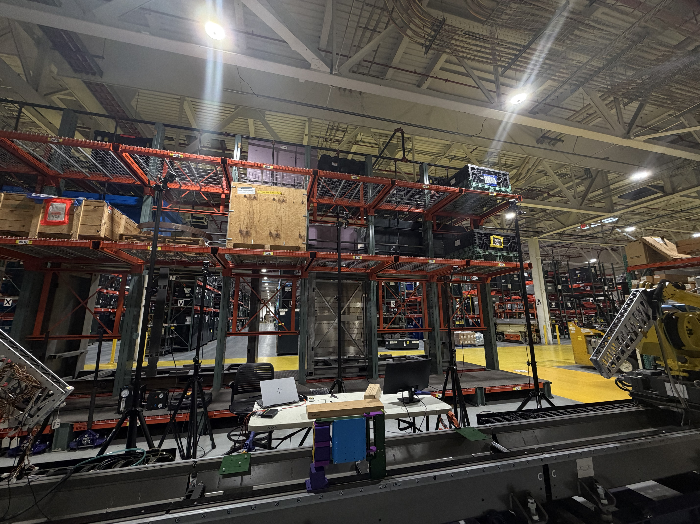
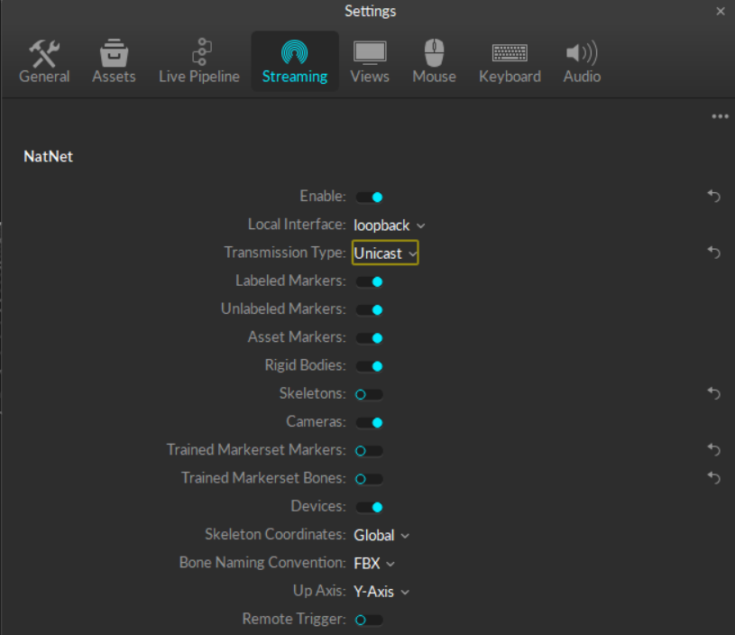
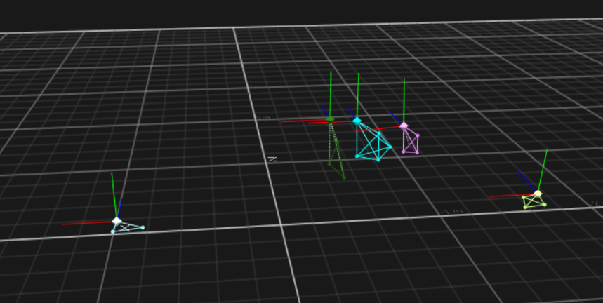
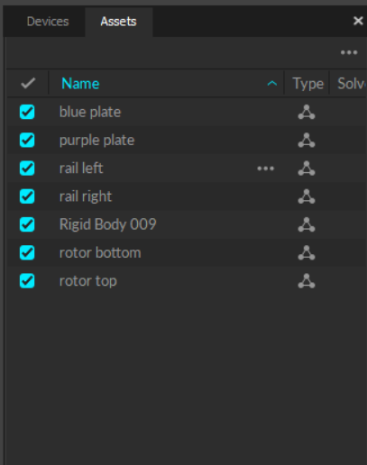
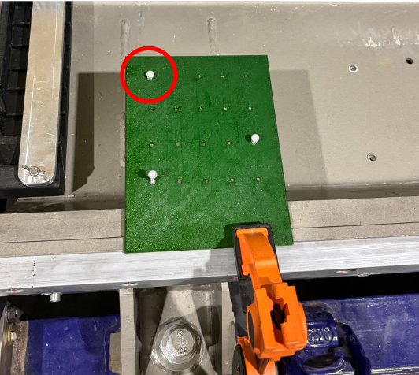
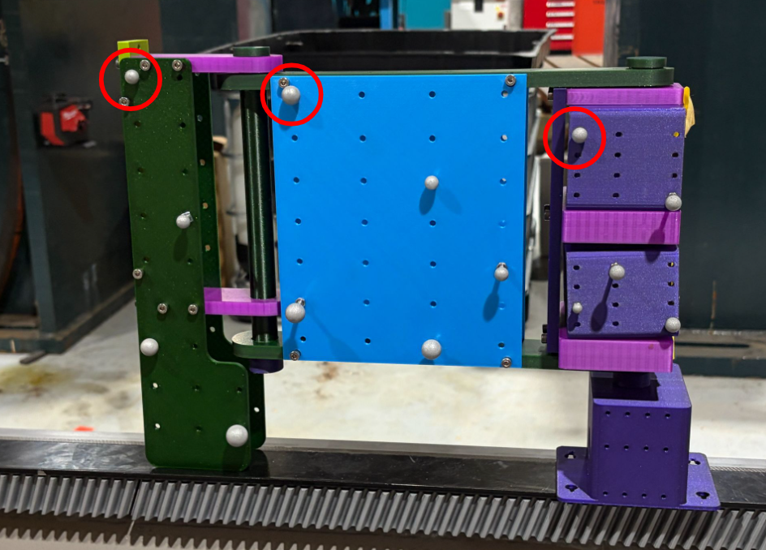

# Camera Tracking

Validates the position the FANUC controller *reports* against an independent OptiTrack
measurement of the same hardware. The system isn't written in those specific terms —
the general form is *any object with two or more independent pose estimates, and the
difference between them*. The rotor and the hand are the first two instances, not
special cases.


## Requirements

### Software
- **Visual Studio 2022** toolchain, **CMake ≥ 3.25**, **Ninja**
- **NatNet SDK** (4.5 tested) — not vendored, not in vcpkg. You point CMake at it yourself (see below).
- **[Motive](https://optitrack.com/software/motive/)**, streaming over NatNet, with rigid bodies defined and [pivots set](#objects-and-their-pivots)
- **vcpkg** is vendored at `./vcpkg`; the CMake presets already point the toolchain at it

### Hardware components
- OptiTrack camera volume covering the tracked cell
- Reflective marker clusters mounted on each tracked object (rail, rotor, hand plates)
- FANUC robot + rail (or the FANUC stub publisher, for bring-up with no robot present)
- A PC running Motive, on the same network/interface as the machine running this software



## Clone the Project and Set Up the Environment

### Clone the repository
```bash
git clone git@code.siemens-energy.com:psc-development/p2d2/software/camera-tracking.git
cd camera-tracking
git submodule update --init vcpkg
```

`vcpkg` is a submodule, and the presets set `CMAKE_TOOLCHAIN_FILE` to
`vcpkg/scripts/buildsystems/vcpkg.cmake` — without that init, configure fails on a missing
toolchain file. (`external/mulib` is a second submodule, unreferenced by the build; leave it
uninitialised.)

### Get the Munera checkout
The frontend consumes `mulib` and `ludus` (from the Munera repo group) as `add_subdirectory`
source by default. Check it out **next to this repo**, as `../Munera`, or point CMake at it
with `-DMUNERA_DIR=<path>`.

### Point CMake at the NatNet SDK
CMake fails hard with an explicit message if `NATNET_SDK_DIR` is unset. Copy the `*-local`
presets in `CMakeUserPresets.json` and set `NATNET_SDK_DIR` to wherever you installed the SDK —
that file is machine-local and should not be committed as-is.

## Build

There are two ways to get `mulib`/`ludus`, chosen by a CMake flag + vcpkg manifest feature.
`frontend/CMakeLists.txt` is byte-for-byte identical either way — both modes alias to the
same targets.

### Option A — local source 
```bash
cmake --preset windows-msvc-debug-local
cmake --build --preset build-debug-local

# release
cmake --preset windows-msvc-release-local
cmake --build --preset build-release-local
```

### Option B — vcpkg registry

Pulls `arena`, `mulib` and `ludus` as built packages from the private registry
(`vcpkg-configuration.json`) instead of compiling `../Munera` locally — no Munera checkout
needed. Enabled with `-DMUNERA_FROM_REGISTRY=ON` plus the `munera-registry` vcpkg manifest
feature; the `*-registry-local` presets already set both.

```bash
cmake --preset windows-msvc-debug-registry-local
cmake --build --preset build-debug-registry-local
```
Installed packages land in `out/vcpkg_installed` (local) or
`out/vcpkg_installed_registry` (registry), binaries in `out/build/<preset>/<config>/`.

### Tests
```bash
ctest --preset test-debug
```

`test-debug` is bound to the `windows-msvc-debug` configure preset, not to the `*-local` ones —
if you only ever configured `windows-msvc-debug-local`, run the tests against that build tree
directly instead:

```bash
ctest --test-dir out/build/windows-msvc-debug-local -C Debug --output-on-failure
```

### Lint

```bash
python scripts/lint.py            # config checks + clang-format, report only
python scripts/lint.py --changed  # C++ scope = what you touched vs HEAD
python scripts/lint.py --fix      # rewrite those files in place
python scripts/lint.py --tidy     # add clang-tidy, against a configured preset
python scripts/lint.py --qml      # add qmllint, via Qt's generated all_qmllint target
```

Four checks behind one entry point. **Config** always runs and needs no tools: every JSON in
the repo parses, and every `config/scene*.json` goes through `check_scene.py`. **clang-format**
uses [`.clang-format`](.clang-format), calibrated to the code already here — 4-space, 100
columns, Allman braces, and `SortIncludes: Never` because the include order in
`backend/src/main.cpp` is deliberate. **clang-tidy** uses [`.clang-tidy`](.clang-tidy) and the
`compile_commands.json` of the most recently configured preset; its `HeaderFilterRegex` is what
keeps the report to this project's own headers rather than all of Qt, eCAL and Eigen.
**qmllint** is Qt's, driven through the target `qt_add_qml_module` already generates.

## Demo: the renderer with no hardware

`config/scene_demo.json` is a scene that needs no Motive, no cameras and no robot bridge. Use it
to prove a fresh build actually runs, or to show the renderer to someone. It holds two objects:

| Object | Placements | Where the pose comes from |
|---|---|---|
| `p2d2` | `p2d2_mount`, `p2d2_posed` | static anchor, plus the whole 34-link cell from `Rendering/p2d2.urdf` drawn at its URDF home pose |
| `stub_demo` | `stub_demo_nominal`, `stub_demo_reported` | a fixed point, and the simulated FANUC publisher — a 0.5 m circle at 1 m height, one lap per 8 s |

Both `stub_demo` placements are comparable, so the pair publishes a delta that sweeps 0 → 1000 mm
and back every lap. That is the point of it: a delta that visibly moves shows the placement and
comparison path is live, not printing a constant.

**Nothing in this scene is a measurement.** No number it produces says anything about the robot,
the rig or the cameras — the "error" in that delta is just the distance between a fixed point and
a circle drawn around it.

### Switching to it

Two keys in `config.json` — the manifest path, and the flag that lets the backend start without
Motive:

```jsonc
"scene":     { "manifest": "config/scene_demo.json" }, 
"optitrack": { "required": false }                       
```

Leave `fanuc.stub_enabled` at `true`; it is what publishes `pose_fanuc`. Then check the manifest
and run:

```bash
python scripts/check_scene.py config/scene_demo.json
out/build/windows-msvc-debug-local/Debug/cameratracking.exe
```

`check_scene.py` should print `ok: 2 objects, 4 placements, 0 Motive bodies ()`. The executable
finds `config.json` by walking up from wherever it is started, so running it out of the build
directory is fine.

### What you should see

- `[backend/optitrack] optitrack.required=false - skipping Motive/NatNet. Only static and
  expected_pose placements will be positioned.` and `[backend/fanuc] stub enabled`.
- **Home**, then straight through to **Position Tracking** — the review gate is derived from both
  sides of a delta being latched, and nothing here is, so there is nothing to review.
- The cell at its home pose, with the `NO JOINT STATE` banner up, since the robot bridge is what
  would pose it and nothing publishes.
- The hand assembly circling once per 8 s, the grey copy of it sitting still at the start of the
  lap, and one comparison row counting up and back down between them. Turn logging on and it
  writes `logs/comparisons_<timestamp>.csv` like any other session.

### Putting it back

Set `scene.manifest` back to `config/scene.json` and `optitrack.required` back to `true`. That
second one matters: left at `false` before a real session, the backend comes up dark instead of
refusing to start, and a scene with no camera data looks a lot like a scene with bad camera data.

## Test Procedure

### Set up Motive

1. **Point Motive's Data Streaming pane at the same interface `config.json` uses.** If Motive
   is bound to a LAN adapter (`192.168.x.x`) and `optitrack.motive_server_ip` in `config.json`
   says `127.0.0.1`, the connection fails even on one machine — the two must be on the same
   interface.

   

2. **Define a rigid body for every tracked object** (rail, rotor, each hand plate) and set each
   one's **pivot** by hand at a point CAD knows. This project has no calibration step by
   design, and no mount-offset field to correct a pivot that is wrong — Motive's rigid-body
   frame *is* the placement's frame, so the pivot has to be right in Motive. Record which
   asset id Motive assigned; it goes in the object's config file. Which point, body by body,
   is [Objects and their pivots](#objects-and-their-pivots).

   

3. **Check the Assets pane.** Every body defined and enabled, and each one's mean marker-fit
   error small before you trust it — that error is what `optitrack.max_mean_error_mm` in
   `config.json` screens against per-frame.

   

   Names here are for humans. The backend binds a placement to a body by **streaming id**
   (`asset_id` in the object file) and never by name — the green hand plate above is still
   `Rigid Body 009`. Rename it anyway, so this pane can be read at a glance.

### Mount the marker clusters

Bolt each cluster to its object, define the body in Motive, and put its pivot on the one marker that object's config file describes — the specific point for each of the seven bodies is in
[Objects and their pivots](#objects-and-their-pivots).

### Running the software

Launch **`cameratracking.exe`** 

It starts all three three executables (`backend`, `logger_node`,
`frontend`) under a Windows job object and guarantees none can
outlive the session, including if the launcher itself is killed.

`optitrack.required` in `config.json` controls whether the backend refuses to start without a
live Motive connection.

The app is three screens, forward-only:

| Screen | What it does |
|---|---|
| **Home** | Waits until every gated delta has a reading (or there is nothing to gate). |
| **Rotor Placement** | The review gate — shows latched deltas with a severity ramp; accept or abandon. Skipped if the manifest holds only continuously-tracked objects. |
| **Position Tracking** | The live comparison readout. CSV logging runs exactly while this screen is active and the operator's logging toggle is on. |

<!-- TODO: one screenshot per screen — assets/screen_home.png, screen_rotor_placement.png, screen_position_tracking.png -->

A full-width banner appears on all three screens whenever joint state is absent from the
robot bridge, so a robot posed from no data is never mistaken for one posed from a real
measurement.

## Objects and their pivots

A body's **pivot** is where Motive puts that body's origin, and here that is the entire mount
calibration. There is no offset field between a tracked body and its placement, because Motive's
rigid-body frame *is* the placement's frame — nothing in this repo fits it, and nothing
downstream can correct it.

So each pivot goes on **one marker of the cluster, at a point CAD knows**: pick the marker whose
seat you can read off the drawing (a plate corner is the easy one), drop the pivot on it, and
every coordinate in that object's config file is then stated about that same physical point.

Three things to know before setting one:

- **Keep the pivot inside its own marker cluster.** The latch gate measures spread on the
  composed model pose — where Motive put the body — so a pivot far from its markers can rock
  through an arc the position spread never sees. Where the origin genuinely sits away from any
  cluster (the rail, the rotor), the answer is two bodies and the chord between them, not one
  distant pivot.
- **A pivot's orientation is a separate claim, and nothing checks it.** Create the bodies
  world-aligned. Motive streams Y-up while every URDF in this tree is Z-up, so wherever a body
  frame meets a link frame that right angle is owed explicitly — `hand_mount` in `hand.json` is
  where the hand pays it.
- **Re-pivoting voids the config.** Redefine a body or nudge its pivot and the CAD numbers in
  `config/objects/` stop describing it, silently — no output can tell. The `calibrated` block in
  each object file exists for exactly this: the date, the Motive asset revision, and any mount
  detail (which blade grooves the rotor clamps sat in) a later reader would otherwise guess at.

| Motive body | `asset_id` | Object file | Capture | Pivot sits at |
|---|---|---|---|---|
| green plate (`Rigid Body 009`) | 1 | `hand_left_base.json` | continuous | corner marker — root of the tracked hand chain |
| blue plate | 2 | `hand_left_j8.json` | continuous | corner marker — the measured J8 link |
| purple plate | 3 | `hand_left_j9.json` | continuous | corner marker — the measured J9 link |
| rail left | 4 | `rail.json` | latched | `mount_a` — one end of the anchor chord |
| rail right | 5 | `rail.json` | latched | `mount_b` — the other end |
| rotor top | 6 | `rotor.json` | latched | `mount_a` — end of the top clamp bar |
| rotor bottom | 7 | `rotor.json` | latched | `mount_b` — end of the bottom clamp bar |

In a `constructed` placement the pairing is **positional**: `inputs[0]`'s pivot is `mount_a`,
`inputs[1]`'s is `mount_b`. Cross them and the frame is built end-for-end while every internal
check — chord length, normal disagreement — stays clean, because both sides are consistently
wrong. The rotor's two clamp standoffs were crossed exactly this way until 2026-08-20.

### Rail — `rail left` and `rail right`

 

*The circled marker on each plate is that body's pivot. `mount_a` and `mount_b` in `rail.json`
are those two markers' positions in the rail's own CAD frame — read off the drawing, not
measured on the day.*

The rail is the **world anchor** (`scene.json` names `rail_origin`), and everything this project
publishes is stated in its frame, so these are the two most consequential pivots in the scene.
It is built from two bodies for that reason: the ~1.65 m chord between the plates fixes the
rail's direction and every rotation about the axes across it, leaving only the roll about the
chord for the bodies' face normals to supply. One body would have to carry the anchor's full
orientation on a ~120 mm marker triangle — orientation being what a small cluster constrains
worst.

One assertion survives the construction: `normal_in_part`, i.e. which body axis is the mounted
face's normal. On the rail no internal check can catch naming "up" for "across", since both are
perpendicular to a chord running along the rail, and the mistake rolls the anchor 90° about its
own length and takes every other object with it. `expect_normal_in_parent` is the external fact
that catches it — keep it filled.

Moving the two plates further apart is the cheapest accuracy in the system, and it multiplies
into every object downstream.

### The hand — three plates on one arm



*Green, blue, purple: `hand_left_base`, `hand_left_j8`, `hand_left_j9`. One circled corner
marker per plate, one pivot each.*

Each plate is pivoted on a corner marker rather than on the hinge it turns about, and the config
states that rather than assuming otherwise: `hand_left_j8.json` carries a `zero_pose` — where
that pivot sits in its parent's frame with the joint at zero — **and** an `axis_point`, a point
on the hinge itself. URDF would assume the axis passes through the child frame it defines, which
is wrong for a fiducial on a plate corner: a mount 100 mm off its axis *orbits* that axis,
`2·r·sin(θ/2)` = 141 mm over a 90° sweep, and a model expecting a fixed offset would charge all
of that to measurement error. Both numbers are stated against the pivot, so both are void the
day a plate is re-pivoted.

**Create the three plates in one sitting**, hand held still, all three world-aligned. That is
what makes the identity rotation in each `zero_pose` a true statement; doing it piecemeal is what
produced −41.14° of outstanding turn on J8 against −50.28° on J9, when the two should have been
equal.

The green plate is the chain root — bolted to the MOAT, so no hand joint moves it, and the
largest plate, so the widest marker spread and the best-constrained orientation, which is the
only thing a revolute projection consumes. Nothing upstream measures it, so its own error is
common mode: it shifts θ8 and θ9 together instead of showing in either residual. The toolpoint
comparison against the robot is what will catch it, once the bridge publishes.

## Configuring a Scene

```
config/
  scene.json           which objects are active, and which placement anchors the world
  objects/
    rail.json          one file per PHYSICAL object
    rotor.json
    hand_left_base.json
    hand_left_j8.json
    hand_left_j9.json
    hand.json          the drawn hand, posed from the measured angles
config.json            runtime knobs: topics, rates, thresholds, tolerances
```

**Swapping `"rotor"` for a `"rotor_b"` entry in the manifest is the entire procedure for
changing rotors** — an object's mesh and its mount geometry must travel together in one file, or
you can end up pairing one rotor's geometry with another's mount offsets.

### Adding an object
1. Define its rigid body in Motive and set the pivot at a CAD point — see
   [Objects and their pivots](#objects-and-their-pivots). Note the streaming id.
2. Write `config/objects/<name>.json`: an id, display name, mesh path relative to the repo
   root, and one entry in `placements` per independent claim about where it is.
3. Add `"<name>"` to the `objects` array in `scene.json`.
4. Run it — comparisons, review gating, render rows and CSV columns all follow automatically.

### Meshes
STL carries triangles only — origin, units and spin axis are export-time intent the format
doesn't record. Before trusting a new mesh:
```bash
python calibration/inspect_mesh.py <file>
```
It measures origin/units/axis from the geometry and checks them against the project's mesh
convention. `calibration/recentre_mesh.py` fixes a wrong datum as a pure, recorded translation
— re-run after every CAD re-export, and never hand-edit the derived file.

## Reading the Output

### eCAL topics

| Topic | Message | Publisher |
|---|---|---|
| `scene/placements` | `ScenePlacementsPacket` | backend — the whole scene, republished periodically |
| `scene/comparisons` | `ComparisonPacket` | backend — the headline deltas |
| `scene/joint_estimates` | `JointEstimatePacket` | backend — per-joint angle + geometry checks |
| `robot/joint_state` | `JointStatePacket` | the robot bridge |
| `pose_fanuc` | `PosePacket` | the FANUC stub publisher |
| `hand/joint_state_measured` | `JointStatePacket` | backend — the cameras' own answer, in the controller's format |
| `session/control` | `SessionControlPacket` | frontend — the one topic that flows the other way |

### The CSV
`logs/comparisons_<timestamp>.csv`, one row per delta per tick. Each row carries the delta,
full latch quality for both sides, the anchor's own pose and spread, and the complete arm
configuration at that instant — arm configuration is logged beside every delta because a
rail-origin error has a constant signature while kinematic error varies with arm pose.

See [docs/architecture.md](docs/architecture.md) for the full frame/placement model and
[docs/system-test.md](docs/system-test.md) for the end-to-end test procedure.

## Development

See [HANDOVER.md](HANDOVER.md) for a deeper walkthrough of the placement/comparison pipeline,
the Munera (`mulib`/`ludus`) dependency, and known traps in the build.

## Roadmap

- **Robot bridge (blocked)** — nothing yet publishes `robot/joint_state`. Until it does, every
  `expected_pose` / `joint_state` placement has no input, and the controller side of every
  comparison stays dark.
- **`rail.json`** — validate that the origin is correct
- Fix the hand mount CAD offset before printing (gated on choosing a canonical UTOOL).
