# Architecture

Why the measurement core is shaped the way it is. The headers in
`nodes/common/` state *what* each piece does; this holds the *why*, so the code
can stay readable without the reasoning being lost.

---

## The system, one level down

Each box is a separately deployed thing — a process or a file store — labelled
with the technology it is built from, and every arrow names the interaction and
the protocol that carries it.

One rule explains most of the shape: **the backend owns every transform in the
system**, and the console and the logger are readers. A bug in the user interface
can make the picture wrong, but it cannot make the numbers wrong.

The bus is the seam. No container calls another; each one publishes protobuf and
subscribes to what it needs, which is why the missing robot bridge is a gap
rather than a redesign — it joins on the same terms as everything else, and the
consuming side is already written and waiting for it. All four containers are
launched into a single Windows job object, so a session cannot half-survive: any
container exiting ends the whole thing, because an orphaned backend does not look
broken, it looks like a running system publishing from stale config.

---

## The frame model — one transform in the whole system

The render frame is the **rail origin, as OptiTrack locates it**. Robot-side
data arrives rail-relative already, so it needs no transform; OptiTrack data
needs exactly one.

The single assumption is that the rail origin means the same physical point to
both systems. It is falsifiable: a rail-origin error has a constant,
distance-linear signature, while kinematic error varies with arm configuration —
which is why the full arm configuration is logged beside every delta.

No placement is pre-composed into anchor space. Each registers its edge to the
mocap frame and the registry routes queries through the anchor, so if Motive is
recalibrated and its world origin moves by some unknown `M`, the two `M`s meet
as `M⁻¹·M` in any anchor-relative query and cancel exactly. There is no stored
world origin to go stale.

### Frame naming

`T_<to>_<from>`, read "to ← from". Applying it takes a point in `from` and
returns the same physical point in `to`. Composition reads right to left and the
inner frames must meet.

Eigen will happily compose two `Isometry3d` in the wrong order and hand back a
confidently wrong answer — a scene that renders plausibly and validates nothing.
Making the frame part of the value turns that into an exception at the call site.

### A placement is a claim, and a claim is a frame

An object has one or more **placements**, each one claim about where it is. A
rotor the cameras measure and the same rotor as the robot reports are two
placements and therefore two frames.

**The placement id *is* the frame name**, so ids must be unique across the whole
scene; the loader enforces it. The payoff is that comparisons need no
configuration: any object carrying 2+ comparable placements yields a delta per
pair, and the comparison code never learns what a rotor is.

---

## Two-mount construction — why not offset from one body

A constant offset from one body to the part's origin is expressed in Motive's
body frame, so using it means asserting the **full rotation** between that frame
and the part's CAD frame — then multiplying the assertion by the metres between
them. All three rotational degrees of freedom land on the answer at full lever
arm, and a body's orientation is exactly what a ~120 mm marker triangle
constrains worst. It also has to be *told* all three, and nothing downstream
ever checks the result.

Two bodies instead: the chord between them fixes its own direction and every
rotation about the axes perpendicular to it. Only the **roll about the chord** is
left, and the bodies' face normals supply that. So the single assertion becomes
"which body axis is the mounted face's normal" — mechanical rather than an
alignment exercise, and the two bodies cross-check each other on it.

### Why two CAD points rather than derived quantities

`mount_a` and `mount_b` are the body origins in the part's frame, read straight
off the drawing. Everything else follows: the expected chord is the distance
between them, and **which side of the chord the part lies on is implied rather
than declared**.

That last point is the whole reason for this shape. Parameterising a rotor by
radius, included angle and clocking needs a separate "which way is inward" flag,
because the part is geometrically consistent on either side of the chord — an
unchecked sign worth 2 × the radial offset, about a metre. Two CAD points carry
the same information with no ambiguity to declare.

### What the three checks can and cannot catch

All three (`chord_error`, `normal_disagreement`, `chord_out_of_plane`) are
**internal**: they compare measured geometry against CAD geometry. A consistent
misnaming is consistent on both sides and cancels, so no internal check can ever
see it. Two failures get through:

- **A flipped sign.** Nothing measured distinguishes a face normal from its
  opposite. Wrong, it rolls the part 180° about the chord.
- **A wrong axis at the same angle to the chord.** On the rotor the body's own X
  lands 45° off a chord the real normal meets at 90°, so `chord_out_of_plane`
  fires. **On the rail it does not** — the bodies' "up" and "across" are both
  perpendicular to a chord running along the rail, so naming one for the other
  leaves every check clean and rolls the rail 90° about its own length. The rail
  is the anchor, so that rolls everything.

`expect_normal_in_parent` is the external fact that catches both. It is optional
because it is not always available: a rotor on a stand at an arbitrary attitude
has no expected direction, and a wrong expectation is worse than none. Left
unset, `normal_in_parent_checked` is false rather than reporting a comfortable
zero.

### The `[mounts]` report is for rotationally-arranged parts only

It derives `mount_b` by rotating `mount_a` about the part's axis, which means
something only when the two mounts sit at the same radius on a disc. For the
rail — two bodies at the same attitude along a line — it comes back with both
mounts at the same end. Take only `normal_axis` from it there.

---

## Joint projection

Three rigid bodies on a 3-DOF hand is eighteen numbers where three are real.
Fifteen are measurement error, and a marker cluster small enough to fit on a hand
link constrains **orientation** worst — which is the only thing a revolute joint
is made of. Chaining the links through their joints converts that redundancy
into an error estimate instead of leaving it as noise in the rendered pose.

### The axis is carried explicitly

URDF assumes a joint's axis passes through the child frame it defines. That is
wrong for any tracked body whose frame is a machined fiducial rather than a
kinematic datum: a marker mount on a plate corner can sit 100 mm off its own
axis, and it **orbits** that axis as the joint turns — `2·r·sin(θ/2)`, which at
r = 100 mm is 141 mm over a 90° sweep. A model predicting a fixed offset would
charge all of that to measurement error.

### What stays independent of θ

Position no longer is — the child origin traces a circle. But two scalars are,
because a rotation changes neither a point's distance from its own axis nor its
position along it:

| | Meaning when non-zero |
|---|---|
| `radial_error_m` | the axis is in the wrong **place** |
| `axial_error_m` | the axis points the wrong **way** |

**Read these before trusting any angle.** They hold steady while the joint
sweeps, so a persistent value is geometry, not motion. They are reported
separately because the fixes differ; a single blended residual would hide which.

### Why no solver library

`orocos-kdl` is already a dependency and its `ChainIkSolverPos_LMA` would
converge to the same answer — via an initial guess, an iteration cap, an epsilon
and three failure codes, on the mocap callback thread, to compute an `atan2`. It
would also be worse at the singularity: LM converges to whatever the initial
guess was nearest and reports success, where two dot products detect the case
exactly and refuse.

### Why there is no fit mode

There was one, removed 2026-08-19 after it produced two confidently wrong
answers. The reason is structural rather than bad luck: a child joint's samples
can only be expressed in its parent's **corrected** frame, so the fit is
contaminated by the very geometry error it exists to find. It is least
trustworthy on the deep joints, where a drawing is hardest to read, and most
trustworthy at the root, where the drawing is easy.

The hinges come from the drawing instead, and the system is over-determined, so
it checks itself: each hinge is the intersection of two circles whose radii the
drawing states, and the CAD J8-to-J9 separation of 262.50 mm picks which of the
four branches is real. The orbit radius each solution implies came back within
0.05 mm of the drawing on both joints.

---

## Latching

A latched pose used to be the first frame in which the body was tracked — one
sample, full sensor noise, and no way to tell a good latch from a bad one. For
the anchor that is fatal: every pose in the session is relative to it, so an
outlier there biases every number **consistently**, which reads as systematic
robot error rather than as a mocap glitch.

The policy is now: sliding window → seed (per-axis median + sign-aligned
quaternion mean) → reject outliers past `mad_k` robust sigmas → gate on reject
fraction and dispersion → commit the mean of the survivors. Spread is measured
on the **composed model pose**, so it describes the model origin rather than the
markers.

### `spread` and `std_err` are not the same number

- **`spread`** is per-sample dispersion and does *not* shrink with N. It is the
  stationarity test — was the object actually holding still.
- **`std_err`** is `spread/√N`, the error bar on the committed pose.

A slowly drifting object has a tiny `std_err` and a large `spread`; only the
spread catches it. Without both published, an error bar of 4 mm and a delta of
4 mm were indistinguishable.

### Failure is not terminal

A placement failing the gate stays unplaced and is named in `[placement]` status
with the reason. Accumulation continues indefinitely, so clearing the volume or
re-seating a mount lets it latch without a restart — `timeout_s` only affects
reporting.

---

## Comparison

Nothing in that path is written for a rotor. Because a placement id *is* a frame
name, two claims about one object are two frames in one registry, and the delta
between them is a routed query — the same code that produced the hand results
will produce the rotor results. The picture forks off the same graph: render rows
are keyed by placement id rather than object id, so one mesh asset is parsed once
and drawn once per visible placement, each copy moved independently by its own
claim. Seeing the measured rotor and the reported rotor as two bodies with a
visible gap between them *is* the delta, before anyone reads a number.

A hand moving at 500 mm/s with 20 ms of thread skew fabricates 10 mm of "error",
the same order as the quantity being measured. So two **continuous** placements
are only comparable when sampled close enough in time; pairs further apart than
`max_match_gap_sec` are reported invalid rather than fudged. Latched placements
ignore this entirely.

`invalid_reason` and `skip_reason` are never empty when the corresponding valid
flag is false. **An absent delta and a delta of zero must never look alike.**

### The review gate

A continuously tracked pair is a stream you can watch and average, so a bad one
announces itself. A latched pair is a single claim decided at startup — if it is
wrong, you find out by never finding out. So the frontend holds the session on
exactly those deltas before tracking begins.

The gate is derived purely from both sides being latched, not from any object
id. Add another bolted-down object and it is reviewed too, for free. Abandoning
exits with code **2**, which the launcher reports distinctly, because "these
numbers are wrong, I'm recalibrating" and "it crashed" call for opposite
responses.

---

## Units

Metres and radians internally, without exception. Millimetres and degrees exist
only where a human or a wire is involved:

- **config files are authored in mm/deg** and converted once, on load, in
  `scene_config`'s `parseOffset`
- **published deltas and joint estimates are in mm/deg**, being the human-facing
  end

Nowhere else. `frames::convert` is the only place units or layouts change.

---

## Traps worth keeping in mind

- **Motive's `Local Interface` must match `optitrack.local_address`.** Loopback
  talks to loopback, LAN to LAN. Mixing them fails even with both on one PC, and
  the failure looks identical to Motive not running.
- **Mocap stamps are local arrival time**, on the same steady clock the fanuc
  side uses — *not* `data->fTimestamp`, which is seconds since Motive started, a
  different time base no downstream matcher can pair against.
- **Whole mocap frames are delivered together**, not per-body callbacks.
  Placements captured from different instants cannot be composed: latching the
  rail from frame N and the rotor from N+3 silently mixes two moments into one
  geometric claim.
- **FANUC reports J3 relative to J1.** `JointStatePacket` carries the values
  unmassaged, so anything driving a URDF chain must add J2 to J3 —
  `RobotScene::applyJointState` is where this project does it.
- **Joints are matched to the URDF by name, not index.** Keep it that way.
- **Baking an assembly: compose rotations, don't sum translations.** In
  `p2d2.urdf`, `Left_joint_6_to_Left_moat` carries a non-zero rpy, so the 871 mm
  offset that follows lands in X rather than Y.
- **STL records no origin, units or axis** — those are export-time intent the
  format does not carry. Run `calibration/inspect_mesh.py` before trusting a new
  mesh.
